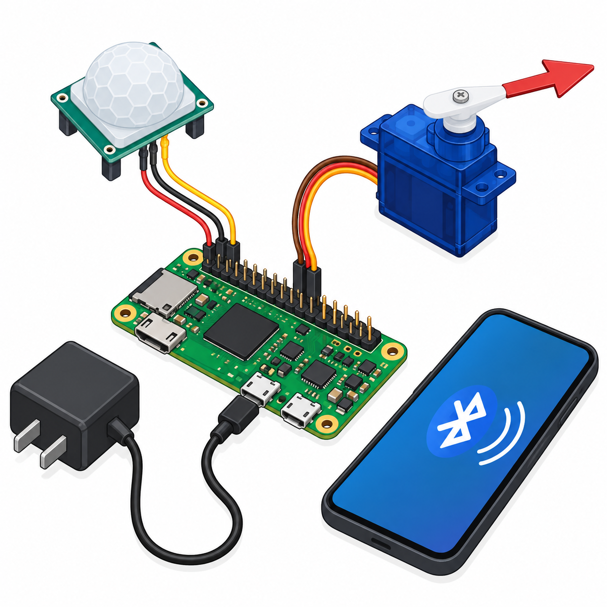

# Smart Entryway Offline Automation
An educational Raspberry Pi Zero 2 W runs a PIR-to-servo **pointer** rule locally. The servo is not attached to a door or lock. Optional BLE exposes status and STOP/RESUME inhibition; local sensing requires no internet, cloud or phone.



## Overview, objectives and features
Learn monotonic timing, PIR startup suppression, bounded motion holds, explicit hardware adapters and local GATT. Wait 60 seconds after startup, move the loose pointer on motion, hold five seconds after last motion, return to rest when inhibited/invalid. Defaults are for a bench demonstration.

## Architecture and platform
Python on Raspberry Pi OS with gpiozero/pigpio PWM and optional Bless/BlueZ BLE. [Policy](src/policy.py) is independent of adapters; [architecture](docs/architecture.md) and [circuit](docs/circuit-diagram.svg). Legacy Controller/evaluate API and --iterations/--interval/--threshold CLI remain compatible for existing tests. The hardware policy uses binary PIR values; --threshold applies only to the compatibility API.

## BOM quantities
| Qty | Item |
|---:|---|
| 1 | Raspberry Pi Zero 2 W with GPIO header, microSD, USB power |
| 1 | HC-SR501 PIR (verify3.3V OUT) |
| 1 | Micro servo accepting3.3V PWM and loose lightweight pointer |
| 1 each | Regulated5V≥1A external supply and1A fuse |
| 1 each | Breadboard and jumper set |
| 1 optional | BLE central phone/test application |

## Prerequisites and exact pin map
Raspberry Pi OS, Python3.11+, working pigpio daemon and Bluetooth/BlueZ only if BLE is enabled. Pin numbering is **BCM**, not header position.
| Signal | BCM / physical | Rail |
|---|---|---|
| PIR OUT | 23 /16 | ≤3.3V input |
| Servo signal | 17 /11 | 3.3V PWM |
| Common GND | GND /6 | Pi/PIR/servo/supply return |
| PIR VCC, servo V+ | External supply, not Pi header | fused5V |
| Pi power | microUSB power port | separate5V |

## Circuit/wiring and assembly
Disconnect both supplies; follow [SVG](docs/circuit-diagram.svg) and [wiring](docs/wiring.md). Join grounds but keep external positive off Pi5V pins to avoid backfeed. Verify PIR output voltage before GPIO connection. Fit only a loose pointer; confirm servo3.3V signal compatibility and its datasheet. Start with no arm fitted while calibrating pulses.

## Setup, installation and configuration
```sh
sudo apt install python3-venv pigpio bluez
sudo systemctl enable --now pigpiod
python3 -m venv .venv
. .venv/bin/activate
pip install -r requirements.txt
python -m src.main --iterations 10 --interval 0
```
Python is deployed by copying this repository to the Pi; no firmware flashing step is needed. Some OS images require installing/enabling pigpio from the distribution’s documented package; verify the daemon before use. Defaults: BCM17/23, warmup60s, hold5s, servo PWM20ms with1ms rest and1.5ms active. Calibrate min/max pulse widths in src/hardware.py with the arm removed. Do not change beyond rated travel.

## Usage
```sh
python -m src.main --hardware --iterations 0 --interval 0.1
# Optional local BLE adapter:
python -m src.main --hardware --ble --iterations 0 --interval 0.1
```
0 iterations means continuous **only in hardware mode**. Ctrl-C performs cleanup and commands rest. Default simulation has no GPIO/BLE imports; its model time advances10s per step regardless of wall interval. Hardware mode uses monotonic time. If BLE startup fails the process exits through cleanup; retry without --ble for local operation.

## BLE, telemetry/data formats and expected output
Advertised name Entryway16. Service a0160000-1313-4444-8888-000000000016; status suffix0001 is read/notify; control suffix0002 is write. Read/notifications are UTF-8 JSON; writes are exact ASCII STOP or RESUME. Invalid commands are ignored. RESUME clears prior hold and still requires PIR activity. Status records: seconds monotonic/model time, motion boolean/null, valid, ready, inhibited, active and servo_value (-1 rest,0 active). USB/stdout adds project_id16 and mode. [Sample](sample-data/telemetry.jsonl). After60s, motion moves pointer toward midpoint; five quiet seconds returns it. This GATT has no application authentication: keep BLE disabled or in an isolated test setting.

## Actual run tests
[Results](docs/validation-results.md) record cloud tests: original compatibility tests, warmup/hold/inhibition/time validity, BLE schema and JSON encoding, image recovery and PNG/SVG/links/MIT/credential gates, Python compile and dependency installation plus CLI simulation. No Raspberry Pi board, physical sensor, servo, BlueZ radio or phone test has been performed. [Test plan](docs/test-plan.md).
```sh
python -m unittest discover -s tests -v
python -m compileall -q src
python tools/validate.py
python tools/validate_completion.py
```

## Troubleshooting
pigpio connection error: start daemon on localhost and verify GPIO permissions. BLE error: check BlueZ adapter availability and D-Bus authorization; omit --ble to test standalone. Pointer jitters: inspect supply current and common ground; use pigpio. PIR stuck active: check sensitivity/retrigger settings and warmup. No output after warmup: verify BCM pin23 and3.3V level.

## Limitations and domain safety
PIR cannot prove occupancy or detect stationary people. It may false-trigger. This pointer is not an access-control mechanism, emergency door system or safety device. No crash/power-loss watchdog guarantees rest. GPIO is not5V tolerant; never power a servo from a GPIO pin. Keep wires and pointer away from pinch points. BLE is unauthenticated and can inhibit/resume the demonstration; use only a trusted isolated environment.

## Future work
Add authenticated BLE, a hardware watchdog and measured sensor/servo characterization. Do not connect it to doors or locks without a separate qualified safety design.

## Contributing and license
Preserve existing Controller tests and add policy/adaptor regression coverage with clear simulation/hardware distinctions. Full [MIT license](LICENSE). Dependencies: [gpiozero servo documentation](https://gpiozero.readthedocs.io/en/stable/api_output.html#servo) and [Bless example](https://github.com/kevincar/bless/blob/master/examples/server.py).
